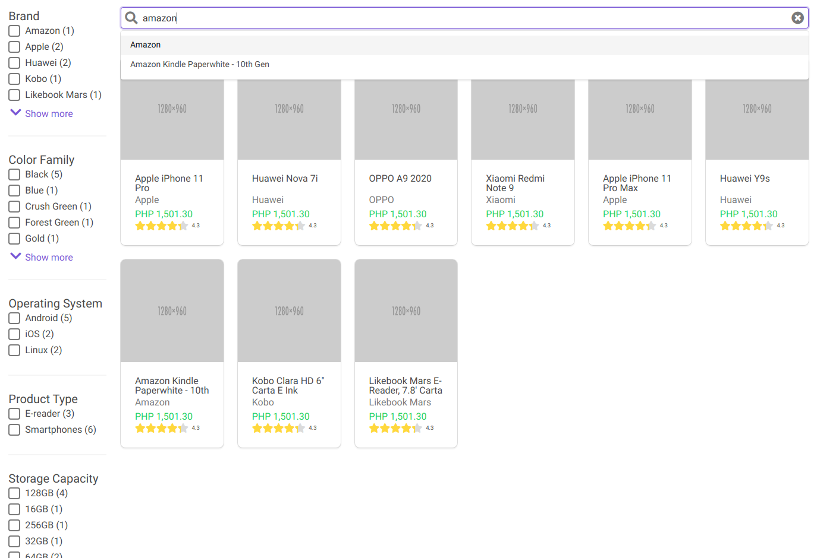

# Multi-Select Facet Example
An example of multi-select facet using [Solr](https://lucene.apache.org/solr), [Vue](https://vuejs.org) and [Go](http://go.dev/). 

Blog post: [Multi-Select Facet with Solr, Vue and Go](https://stevenferrer.github.io/posts/multi-select-facet-solr-vue-go/)



## Running the example

1. Run Solr in docker. 

```console
$ make solr
```
Wait for a few seconds while Solr is loading.

2. Run the API
```console
$ cd cmd/api && go build -v && ./api -init-schema -index-data -init-suggester
```

3. Run the web app (open a new terminal tab)
```console
$ cd webapp && yarn serve
```

4. Open http://localhost:8080 in your browser and start playing with it!


## Contributing
Please feel free to improve this by [sending a PR](https://github.com/stevenferrer/multi-select-facet/pulls) or [opening an issue](https://github.com/stevenferrer/multi-select-facet/issues).

## License

MIT